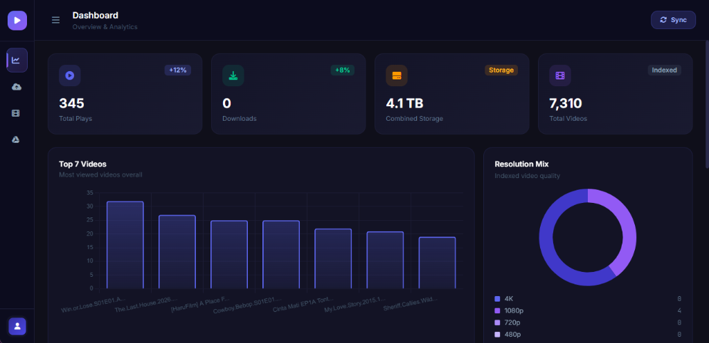
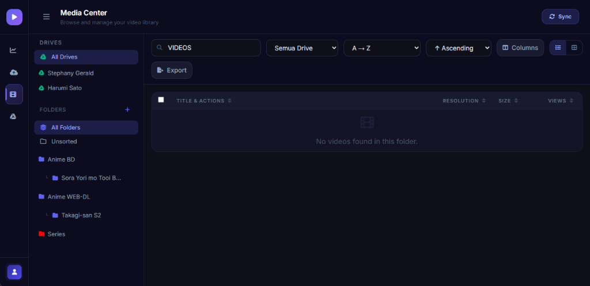
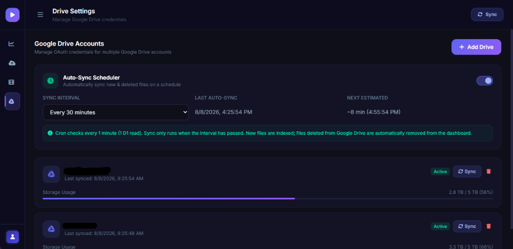
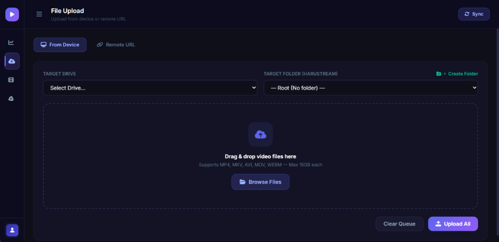

# HaruStream 🎬

[](LICENSE)
[](https://workers.cloudflare.com/)
[](https://developers.cloudflare.com/d1/)
[](https://developers.google.com/drive)

**HaruStream** is a high-performance, serverless video streaming aggregator, proxy engine, and management dashboard built for **Cloudflare Workers, Cloudflare D1 Database, and Google Drive API**.

It allows streaming video files stored in Google Drive directly with custom HTML5 video players, multi-track audio, WASM ASS subtitle rendering, and protocol deep-linking for desktop & mobile external media players (PotPlayer, VLC, MX Player).

---

## 📸 Screenshots & Features Preview

### 📊 1. Overview & Analytics Dashboard


### 📁 2. Media Center & Virtual Folders


### ☁️ 3. Google Drive Accounts & Auto-Sync Scheduler


### 📤 4. File Upload & Remote URL Streamer


---

## ✨ Key Features

- 🔐 **Secure JWT Authentication** — Session tokens signed with HMAC-SHA256 & PBKDF2 salted password hashing.
- ☁️ **Multi-Drive Management** — Connect unlimited Google Drive accounts via OAuth2 Client ID / Secret.
- 📁 **Virtual Folder System** — Organize indexed media freely without altering Google Drive folder structures.
- 🔄 **Automated Sync Engine** — Cloudflare Cron Triggers automatically index new files and prune deleted files every minute (1 D1 read cost).
- 🎭 **Triple Pemutaran (Player System)**:
  1. **ArtPlayer HTML5** — Instant & ultra-fast playback for MP4 & standard video formats.
  2. **Movi-Player WASM** — WebAssembly-powered player with native `.ass` subtitle rendering & multi-track audio selection.
  3. **External Player Protocol Deep-Link** — One-click launcher for **PotPlayer (Windows)**, **VLC Mobile/Desktop**, and **MX Player (Android)**.
- 🚀 **HTTP Range Proxy** — Full seeking support (`206 Partial Content`) with bandwidth throttling and view tracking.
- 📤 **Remote Stream Upload** — Pipe external URLs directly into Google Drive without disk storage.
- 📊 **Analytics Dashboard** — Interactive charts (Chart.js), total storage usage, view counts, and top video stats.
- 📋 **Batch Export Engine** — Export iframe embeds, direct stream links, and HTML codes in one click.

---

## 🛡️ Security & Open Source Readiness

HaruStream is 100% clean and **safe for public GitHub repositories**:
- ❌ **NO hardcoded secrets or API keys** in the source code.
- 🔐 **Credentials & Tokens** are stored securely in **Cloudflare Worker Secrets** (`JWT_SECRET`) and user-specific D1 Database rows.
- 🔒 **Privacy Shield**: Original Google Drive File IDs & credentials are never exposed in public embed links.

---

## 🚀 Quick Deployment Guide

### Option 1: Automated Script (Windows PowerShell)

Run the included automated setup script:
```powershell
powershell -ExecutionPolicy Bypass -File .\deploy.ps1
```

### Option 2: Manual Deployment

1. **Install Dependencies & Login to Cloudflare**:
   ```bash
   npm install
   npx wrangler login
   ```

2. **Create Cloudflare D1 Database**:
   ```bash
   npx wrangler d1 create haru-stream-db
   ```
   *Copy the `database_id` output into `wrangler.toml`.*

3. **Initialize Database Schema**:
   ```bash
   npm run db:init
   ```

4. **Set JWT Secret**:
   ```bash
   npx wrangler secret put JWT_SECRET
   ```

5. **Deploy Backend Worker**:
   ```bash
   npm run deploy
   ```

6. **Deploy Frontend Pages**:
   ```bash
   npx wrangler pages deploy ./public --project-name=haru-stream
   ```

---

## 📁 Project Structure

```
haru-stream/
├── assets/             # Screenshots & Media assets
├── functions/          # Cloudflare Pages Functions routing
├── public/             # SPA Single Page Application (Tailwind + Chart.js)
├── src/                # Cloudflare Worker API & Embed Page Generator
├── deploy.ps1          # Automated PowerShell installer
├── schema.sql          # Cloudflare D1 Database Schema
├── wrangler.toml       # Cloudflare Workers configuration
└── package.json
```

---

## 🔑 API Reference

| Method | Endpoint | Description |
|--------|----------|-------------|
| `POST` | `/api/auth/login` | Authenticate admin user & receive JWT token |
| `GET` | `/api/auth/me` | Validate session token & return profile |
| `GET` | `/api/settings/drives` | Fetch list of connected Google Drives |
| `POST` | `/api/settings/drives` | Register a new Google Drive OAuth2 credential |
| `DELETE` | `/api/settings/drives/:id` | Disconnect a Google Drive account |
| `POST` | `/api/media/sync` | Manually trigger Google Drive indexing |
| `GET` | `/api/media` | Search, filter, and paginate indexed videos |
| `POST` | `/api/media/move` | Categorize videos into virtual folders |
| `DELETE` | `/api/media` | Remove indexed videos |
| `POST` | `/api/folders` | Manage virtual folders |
| `POST` | `/api/media/upload/remote` | Stream remote URL into Google Drive |
| `GET` | `/api/stats` | Retrieve dashboard analytics |
| `GET` | `/embed/:id` | Public HTML5 embed video player |
| `GET` | `/stream/:id` | Proxied video stream endpoint |

---

## 📜 License

Distributed under the MIT License. See `LICENSE` for details.
